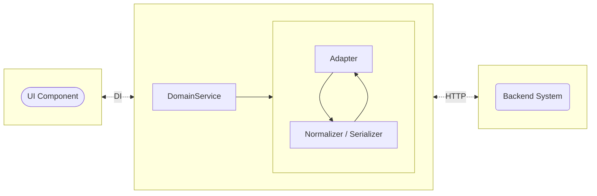
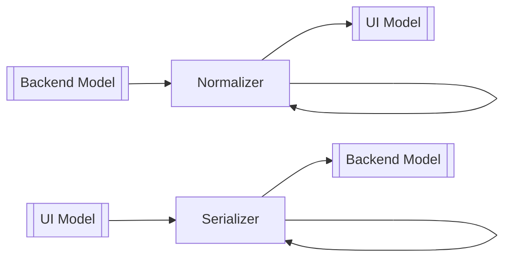

# Domain Services and Adapters

```mermaid
flowchart LR
  subgraph UI [ ]
    UIComponent([UI Component])
  end

  subgraph Domain [ ]
    direction LR

    DomainService[DomainService]
    DomainService --> AdapterLayer

    subgraph AdapterLayer [ ]
    direction TB
    Adapter --> Transformer[Normalizer / Serializer] --> Adapter
    end
  end

  UI <-. DI .-> Domain <-. HTTP .-> Backend

  subgraph Backend [ ]
    direction TB
    BackendSystem(Backend System)
  end
```

### Normalizer/Serializer

```mermaid
flowchart LR
  BackendModel[[Backend Model]] --> Normalizer --> UIModel[[UI Model]]
  Normalizer --> Normalizer
  UIModel2[[UI Model]] --> Serializer --> BackendModel2[[Backend Model]]
  Serializer --> Serializer
```
