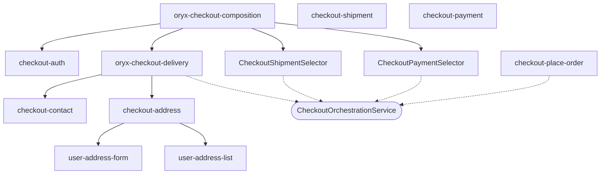
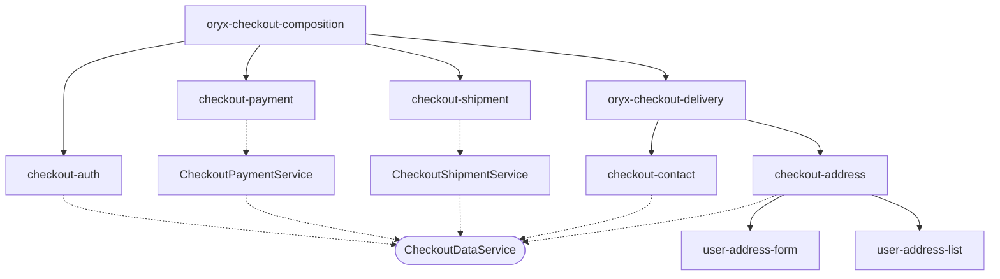
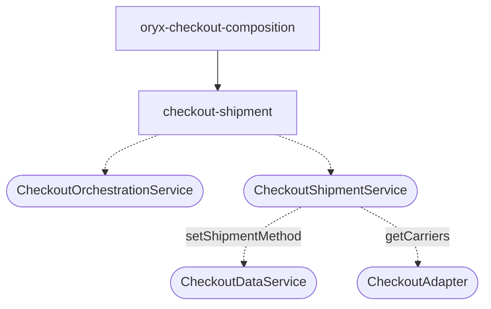
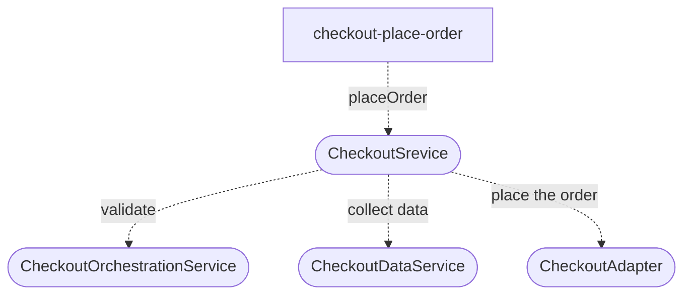
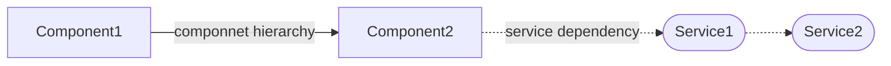

## Checkout components and CheckoutOrchestrationService

`CheckoutOrchestrationService` is the main service that orchestrates the checkout process.

## CheckoutDataService

`CheckoutDataService` is used to set checkout data during the checkout flow.
It is also responsible for persisting the checkout data in the session storage, to be able to restore the checkout flow in case of a page refresh.

## CheckoutShipmentService

`CheckoutShipmentService` is used to set shipment data during the checkout flow. It also exposes available shipment methods for the shipment step.

## CheckoutPlaceOrderComponent and CheckoutService

`CheckoutService` is used to finalize an order. It uses:

- `CheckoutOrchestrationService` to make sure, all required steps are completed
- `CheckoutDataService` to get the data for the order
- `CheckoutAdapter` to place the order

### \*Graph Legend

- Components are represented by rectangles
- Services are represented by stadium shapes
- solid lines represent component hierarchy (DOM structure)
- dotted lines represent service dependencies
