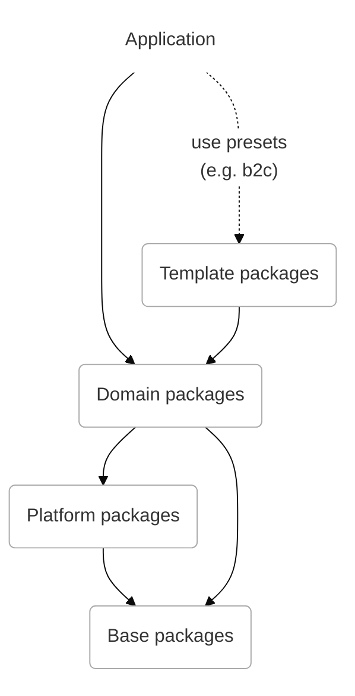

# Packages

## Layers

While packages are all distributed as a flat list, there is an architectural hierarchy. The hierarchy is important as it will protect from cyclic dependencies.

Packages inside a layer can depend on sibling packages inside the layer without any issues. Packages can never depend on a layer above.



### Template packages

This template layer contains packages that can be used as quick starters for demos and projects. Templated packages do follow semantic versioning and will deliver on the promise of upgradability, but are fairly opinionated as they mainly serve to get up to speed fast with a standard frontend application.

### Domain packages

Domain packages provide components, services and adapters for a certain domain. Organising packages in domains helps the developer experience, as its' fairly easy to understand where to find a certain component or service. An example of a domain package is the `product` package, which contains all product related components as well as the product services and adapters that integrates with Spryker APIs.

### Platform packages

The platform layer contains the core packages, including `core` itself. They are providing the infrastructure to the whole system.

### Base packages

The base layer contains packages that serve as utilities to all above layers. An important part of the base layer is the design system package (UI).

## Packages

| Layer        | Packages    | Location                    |
| ------------ | ----------- | --------------------------- |
| **Template** |             |                             |
|              | Presets     | `@spryker-oryx/presets`     |
|              | Application | `@spryker-oryx/application` |
|              | Themes      | `@spryker-oryx/themes`      |
| **Domain**   |             |                             |
|              | Site        | `@spryker-oryx/site`        |
|              | Auth        | `@spryker-oryx/auth`        |
|              | User        | `@spryker-oryx/user`        |
|              | Product     | `@spryker-oryx/product`     |
|              | Search      | `@spryker-oryx/search`      |
|              | Cart        | `@spryker-oryx/cart`        |
|              | Checkout    | `@spryker-oryx/checkout`    |
|              | Content     | `@spryker-oryx/content`     |
| **Platform** |             |                             |
|              | Core        | `@spryker-oryx/core`        |
|              | I18n        | `@spryker-oryx/i18n`        |
|              | Experience  | `@spryker-oryx/experience`  |
| **Base**     |             |                             |
|              | UI          | `@spryker-oryx/ui`          |
|              | Form        | `@spryker-oryx/form`        |
|              | Utilities   | `@spryker-oryx/utilities`   |
|              | DI          | `@spryker-oryx/di`          |

## Module boundaries

NX has a lint rule that allows to enforce module boundaries by configuring tags and assigning them the each package.
We configured our modules to have tags according to the layer. So for now there are following tags:

- `type:app` - all the application inside `apps` folder
- `layer:*` - packages inside `libs/*` folder (ex. `layer:base` or `layer:domain`)
- `lib:*` - separate package, marked individually as exception to add some specific rule. For now it's used to aviod our own violations.

To mark properly new library just add an appropriate layer tag to the `project.json`:

```
"tags": ["layer:base"]
```

## Versioning

Package are published with semantic versioning. The versioning will come with the promise of avoiding breaking changes outside the major version upgrades.

All packages are distributed with the same version, to avoid complex dependency management.

## Distribution

Packages are distributed under the `@spryker-oryx` scope.

## New package creation

To create new package you can generate it:

```
nx g library
```

### What should be done before publishing

Make sure before publishing:

- Edit README, add description of the package and installation example
- Add package into `libs/lerna.json`
- Check `package.json`:
  - Use `@spryker-oryx` namespace in package name
  - Add `"type": "module"` so created package will be published as ES module
  - Add short `description`
  - Use "Spryker Systems GmbH" as an `author`
  - Add "See license in LICENSE" note into `license`
  - Add main entry point: `"main": "./src/index.js"`
  - Add main entry point typings: `"typings": "./src/index.d.ts"`
