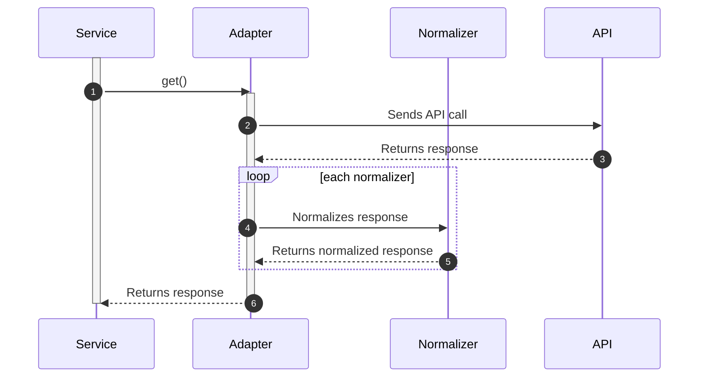

# Building a reactive frontend with Oryx

## Qualify the request

Components, services and adapters are customizable. To ensure that a change in the requested data by a component can be used in lower layers, a best practice is to use a so-called qualifier in the application flow. The qualifier is a single object that will be passed fro application layer to application layer, and can be extended. The example below shows the use of the `ProductQualifier` in the ProductService.

```ts
export interface ProductQualifier {
  sku?: string;
  include?: string[];
}

export class DefaultProductService implements ProductService {
  get(qualifier: ProductQualifier): Observable<NullableGeneric<Product>> {
    return this.getProductData(qualifier).value;
  }
}
```

Whenever the qualifier must be extended, say we like to query the product for a certain brand or supplier, the qualifier can be extended:

```ts
declare global {
  interface ProductQualifier {
    brand?: string;
  }
}
```

This change will be transparent to all application layers and can be picked up by the Adapter layer to use the `brand` field to fetch products by brand.

## Designing the data model

In modern web applications, it is common to communicate with an API to retrieve data. However, the response from an API can often be complex and not suitable for direct use in a component. This is where the concept of client models comes into play. A client model is a representation of the data that is specifically tailored for the needs of the client side application.

In the Oryx framework, we use adapters to transform the response of an API into a client model. Adapters are responsible for making HTTP requests to load data from APIs and also provide normalizers (or serializers) to transform the data into a more readable format. This is especially important when working with complex data standards such as JSON-API, as these can be difficult for a component to work with directly.

By transforming the data from an API into a client model, we are able to abstract away the complexities of the API response and provide a simplified, more accessible representation of the data to the components in our application. This allows us to write components that are easy to maintain and understand, while still being able to take advantage of the underlying data provided by the API.

A sequence diagram of this high-level architecture is provided below:



The following steps are visualized:

1. Service requests data from Adapter.
2. Adapter sends an API call to the API.
3. API returns a response to the Adapter.
4. The Adapter loops through all Normalizers, passing the response through each one.
5. Normalizers normalize the response.
6. The Adapter receives the normalized response from the Normalizer and returns it to the Service.

In order to make the transformation from API models to client models extensible, Oryx utilizes a _multiprovider_ injection token for normalizers. This allows for third-party packages or custom implementations to provide their own normalizers and seamlessly integrate with the existing architecture.

**Note:** While a decoupled data model provides a more flexible architecture and is recommended in the Oryx framework, it does not mean that customizations or 3rd party integration need to follow this practice. There might be good reasons that the architecture is over-engineered for an individual extension, and skipping the normalization can be perfectly fine.
