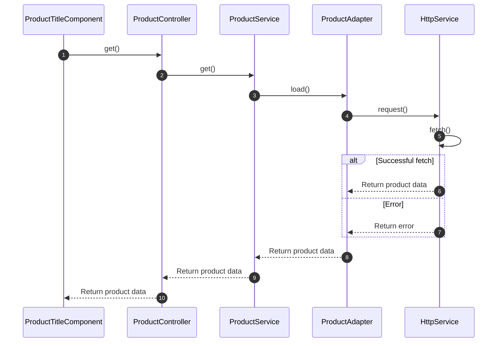

# Key concepts of reactivity

## Working with reactive data streams

Reactive data streams are a fundamental concept in Oryx. They play a crucial role in managing and manipulating data in real-time. Oryx prefers Observables over Promises as they are more powerful and allow for continuous streams of data over time. This is particularly helpful in experiences that remain active during some time, for example, in a Single Page Application (SPA).

An observable can emit different values over time. In Oryx, components are bound to data observed from APIs and stored in the [application state](#application-state). Whenever the application state is updated, a new value is emitted and the component updates its view automatically in an efficient manner.

Oryx makes use of reactive programming through the popular library [RxJS](https://rxjs.dev/). It provides a set of tools and techniques to make it easier to work with asynchronous data streams and event-driven systems. RxJS is a platform agnostic library that provides the following:

- An Observable primitive that can be used as a base mechanism for reactivity with support or bridges into different frameworks, like vue, react, Lit or svelte.
- Ability to emit more than one value (unlike Promises that are resolved only once)
- Ability to resolve value both asynchronously and synchronously (Promises can resole only asynchronously)
- Tried and tested, handy operators to combine streams and define reactive logic.

## Application state

Application state is data that describes the _current_ state of an application at any given moment. It is used to render the user interface and provide the right behavior for user interactions.

Oryx does not come with a global state management layer. Application state is maintained per _domains_. Each domain is concerned with the associated data that is used in the domain.

Some part of the application state is maintained below domains. A good example is the internationalization state (or application context), like active language currency. The internationalization domain is considered a core domain, so it can be used in other domains without introducing cycle dependencies in the system.

## Handling asynchronous data loading

Oryx simplifies working with asynchronous application state and reactivity by handling the complexity under the hood while still allowing customization. It provides vanilla JavaScript packages for services and lower-level layers, which can be reused by developers regardless of UI framework.

Most of the application state is driven by loading data from backend APIs. Oryx provides the following standardized application layers:

| LAYER      | PURPOSE                                                                                                             |
| ---------- | ------------------------------------------------------------------------------------------------------------------- |
| Component  | Renders application state inside UI elements.                                                                        |
| Controller | Resolves application state for the given context so maximize the component reusability                              |
| Service    | Manages the application state for a certain application domain.                                                      |
| Adapter    | Loads the data from a specific backend API and converts it into the client model                                       |
| Http       | Wraps the native http fetch and provides additional utilities to integrate http headers like authorization header. |

Some layers can be considered optional if you build your own domains or components. However, for Oryx these layers are part of the recommended architecture. It increases separation of concerns and provides a clear and clean extension model. All application layers are customizable and allow for an alternative implementation.

The following diagram shows the interaction between layers using the product domain as an example.

Description:

1. The `ProductTitleComponent` is a web component that is concerned with rendering the title in the DOM. The title is typically a `<h1>` element, but this is actually configurable so that the component is reusable in another context (i.e. inside a cart entry component). The product title component does nothing about the context (e.g. PDP vs cart entry), but will rely on a controller to get the context and associated product data. The product title (`name`) is mapped from the product data.
2. The `ProductController` uses finds out the relevant _context_ for the component and resolves the product qualifier (SKU) in order to make the right request. Whenever the product data is resolved, an update to the DOM is requested (this is actually done in the `AsyncStateController` which is left out on this diagram). The `ProductController` uses the `ProductService` to resolve the product data.
3. The `ProductService` is a business service that control the application state for the product. It will make sure that multiple requests for the same product will not result in multiple request to the backend. The `ProductService` delegates actual loading of the data to the `ProductAdapter`.
4. The `ProductAdapter` integrates with the backend, by creating an http request. The `ProductAdapter` knows the backend endpoint and it's contract so that it can create the right request. The `ProductAdapter` delegates actual http requests to the `HttpService`.  
   When an alternative backend is integrated, the `ProductAdapter` can be replaced. The adapter will convert the API data model to the client side model in case of a mismatch (this is done by using normalizers, see [Designing the data model](./best-practice.md#designing-the-data-model).
5. The `HttpService` is a small wrapper that is used to provide additional features such as support for interceptors..

## Propagating updates in the DOM

While observables and RxJS operators provide a great setup for an in-memory reactive system, it won't synchronized this to the UI automatically. Each JavaScript framework comes with it's own concept and techniques on updating the UI. The method of choice contributes significantly to the performance and user experience of the application.

Oryx has standardized its component library on web components and uses (Lit)[https://lit.dev] to develop those components. Lit is capable to update only the mutable parts of the components, and maintains the static parts of the components unchanged. This results in a highly efficient rendering performance.

Oryx offers a `@asyncState` decorator for Lit components, which simplifies the use of reactive streams and reduces code complexity. However, if integrating Oryx with a different web framework, the reactive patterns of that particular framework need to be used instead.
