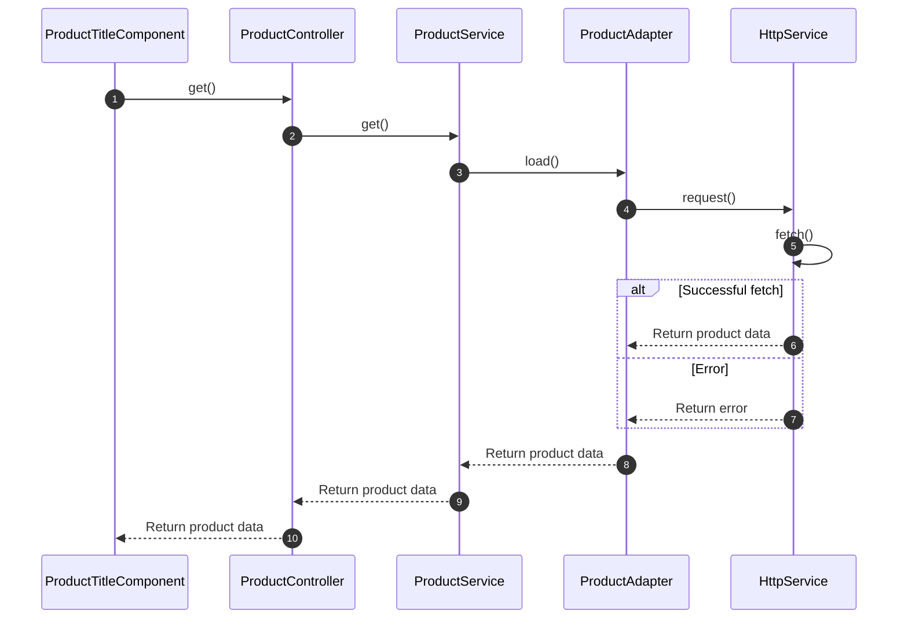

# Key Concepts of Reactivity

## Working with reactive data streams

Reactive data streams are a fundamental concept in Oryx, and play a crucial role in managing and manipulating data in real-time. Oryx prefers Observables over Promises as they allow to keep the application in sync during the full application lifetime. This is particular helpful in experiences that remain active during some time, for example in a Single Page Application (SPA).

An observable can emit different values over time. In Oryx, components are bind to data observed from APIs and stored in the [application state](#application-state). Whenever the application state is updated, a new value is emitted and the component will update its view automatically in an efficient manner.

Oryx makes use of reactive programming through the popular library [RxJS](https://rxjs.dev/). It provides a set of tools and techniques to make it easier to work with asynchronous data streams and event-driven systems.

## Application state

Application state refers to the data that represents the _current_ state of the application. It describes the current state of an application at any given moment and is used to render the user interface and provide the right behavior for user interactions.

Oryx does not come with a global state management layer. Application state is maintained per _domains_. Each domain is concerned with the associated data that is used in the domain.

Some of the application state is maintained below domains. A good example is the internationalization state (aka application context), such as the active language or active currency. The internationalization domain is considered a core domain and can therefor be used inside other domains without introducing cycle dependencies in the system.

## Handling asynchronous data loading

Working with asynchronous application state and reactivity in general is considered complex and it can distract the component developer from building the UI. Oryx therefor moves the complexity of the reactive system under the hood as much as possible without loosing the ability to customize the application. Component developers can reuse services that collect data from the backend and maintain the application state. The services and lower level layers are provided in vanilla JavaScript packages, and is not opinionated about the UI framework of choice.

Most of the application state is driven by loading data from backend APIs. Oryx provides a number of standardized application layers:

| Layer      | Purpose                                                                                                             |
| ---------- | ------------------------------------------------------------------------------------------------------------------- |
| Component  | Renders application state inside UI elements                                                                        |
| Controller | Resolves application state for the given context so maximize the component reusability                              |
| Service    | Manage the application state for a certain application domain.                                                      |
| Adapter    | Loads the data from a specific backend API                                                                          |
| Http       | wraps the native http fetch and provides additional utilities to integrate http headers (e.g. authorization header) |

The various layers can be considered optional if you build your own domains or components. For Oryx these layers are however part of a the recommended architecture. It increases separation of concerns and provides a clear and clean extension model. All application layers are customizable and allow for an alternative implementation.

The interaction between the various layers is illustrated in the following diagram, where we use the product domain as an example.

Description:

1. The `ProductTitleComponent` is a web component that is concerned with rendering the title in the DOM. The title is typically a `<h1>` element, but this is actually configurable so that the component is reusable in another context (i.e. inside a cart entry component). The product title component does nothing about the context (e.g. PDP vs cart entry), but will rely on a controller to get the context and associated product data. The product title (`name`) is mapped from the product data.
2. The `ProductController` uses finds out the relevant _context_ for the component and resoles the product qualifier (SKU) in order to make the right request. Whenever the product data is resolved, an update to the DOM is requested (this is actually done in the `AsyncStateController` which is left out on this diagram). The `ProductController` uses the `ProductService` to resolve the product data.
3. The `ProductService` is a business service that control the application state for the product. It will make sure that multiple requests for the same product will not result in multiple request to the backend. The `ProductService` delegates actual loading of the data to the `ProductAdapter`.
4. The `ProductAdapter` integrates with the backend, by creating an http request. The `ProductAdapter` knows the backend endpoint and it's contract so that it can create the right request. The `ProductAdapter` delegates actual http requests to the `HttpService`.  
   When an alternative backend is integrated, the `ProductAdapter` can be replaced. The adapter will convert the API data model to the client side model in case of a mismatch (this is done by using converters, see [Designing the data model](./best-practice.md#designing-the-data-model).
5. The `HttpService` is a small wrapper that is used to provide additional features such as http headers. It integrates with the `IdentityService` for those requests that require an authorization header.

## Propagating updates in the DOM

While observables and RxJS operators provide a great setup for an in-memory reactive system, it won't synchronized this to the UI automatically. Each JavaScript framework comes with it's own concept and techniques on updating the UI. The method of choice contributes significantly to the performance and user experience of the application.

Oryx has standardized its component library on web components and uses (Lit)[https://lit.dev] to develop those components. Lit is capable to update only the mutable parts of the components, and maintains the static parts of the components unchanged. This results in a highly efficient rendering performance.

The combination of a reactive application state and efficient component rendering requires an explicit update request whenever the application state has changed. To simplify the use of reactive streams in components and avoid complex rendering code, a dedicated decorator (`@asyncState`) is provided in Oryx when you work with Lit components. If you'd integrate Oryx in another web framework you must integrate the reactive patterns from the given framework.
