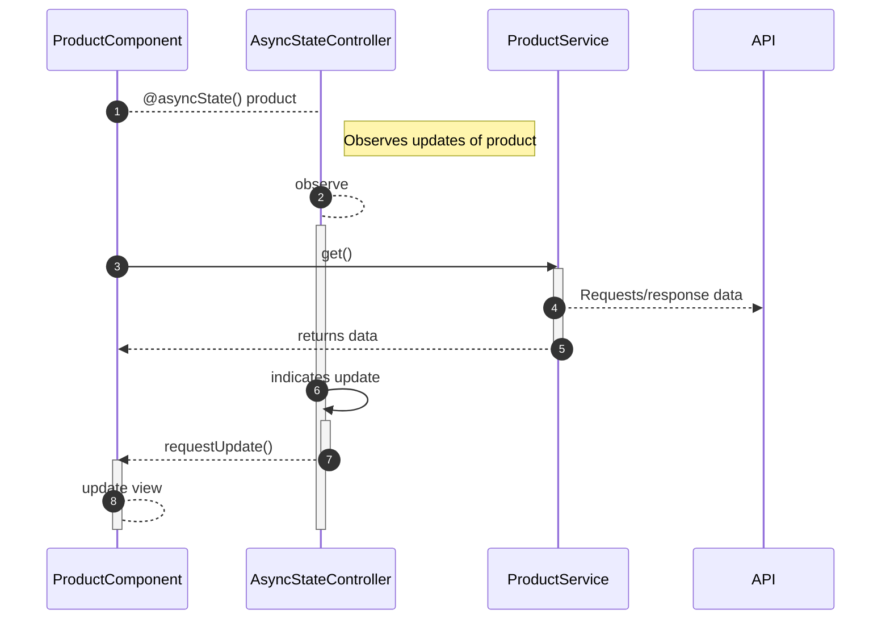

# Reactivity

Reactivity is a fundamental concept in modern web development that enables dynamic, real-time updates to the user interface. In interactive applications, and single-page application (SPA) in particular, reactivity ensures that the displayed data is constantly in sync with the underlying data model, even as that data is loaded asynchronously and in real time from a backend API.

In a reactive frontend, data is treated as _streams_ that continue to emit new values in an asynchronous manner. This allows for a highly responsive and engaging user experience as updates to the data are immediately reflected in the user interface. Examples of reactive behavior include searching for products, adding products to cart, navigating the application.

This is achieved by establishing a connection between the user interface and the data model, so that changes to the data are automatically reflected in the user interface. Reactivity is widely used in modern frontend frameworks, but the the technical solution varies from framework to framework.

## Reactivity patterns in Oryx

Implementing reactivity in a web application is a complex challenge, especially in an SPA where data is loaded asynchronously and in real time from a backend API. Various components dynamically request the same data, and updates of the application state must be managed in a highly efficient way.

The following is a high-level overview of the reactivity patterns available in Oryx. In the diagram, it is shown using a product component.

**Note:** Some of the standard architectural layers of Oryx are omitted in this diagram to keep the focus on the reactive concepts.

The following steps are identified in the diagram:

1. Components are not concerned with _how_ the component lifecycle is wired with the application state; new emissions of application state are automatically updated in the view.
2. Component state is controlled by a _reactive controller_ that knows the component lifecycle. This controller is specific to LIT. If you use another component framework, you can leverage the service's lower application layers, but you need to take care of the component lifecycle yourself.
3. Components delegate the loading of data to a service. API integration is done in lower layers of the application logic: adapters, converters.
4. To avoid duplicated requests in parallel or sequence, API responses are maintained in the service layer.
5. The component receives newly emitted data through the observable stream provided by RxJS.
6. The `AsyncStateController` observes (new) emission of the data stream.
7. The controller requests an update for the component.
8. The component re-renders the requested update (but not for other non-related parts of the application).

## Next steps

[Key concepts of reactivity](./key-concepts-of-reactivity.md)